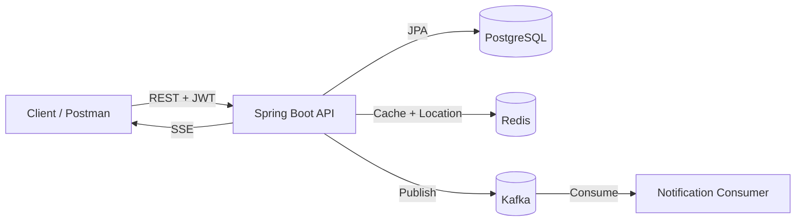
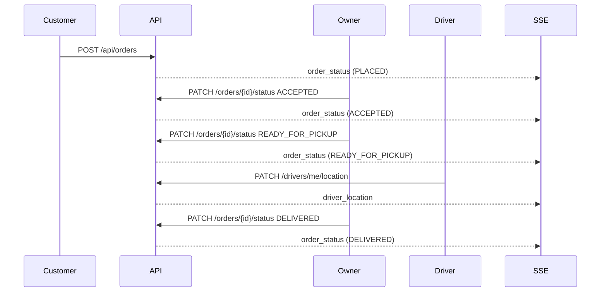

# Food Delivery Tracker


A production‑style **food delivery backend** built with Spring Boot. It covers the full lifecycle from restaurant discovery to order placement, live tracking, and delivery — with **JWT security**, **Kafka events**, **Redis caching**, and **SSE real‑time streams**.

## Why This Project Stands Out
- **Real‑time order tracking** using **Server‑Sent Events (SSE)**
- **Event‑driven architecture** with **Kafka** for order status notifications
- **Redis caching** for fast restaurant/menu reads and driver location
- **Clean domain model** with JPA/Hibernate and PostgreSQL
- **Role‑based security** for customers, restaurant owners, drivers, and admins

## Core Features
- Auth: Register / Login with **JWT**
- Restaurants: Browse, search, and filter by cuisine
- Menus: Restaurant menu browsing
- Orders: Create order, view history, update status with validation
- Drivers: Auto‑assign, live location updates
- Real‑time: SSE stream for order status + driver location
- Caching: Redis caches restaurants + menus and last known driver location
- Kafka: Order status events published and consumed
- Global error handling with structured JSON responses

## Tech Stack
- **Java 21** / **Spring Boot 3.5**
- **PostgreSQL** + **JPA/Hibernate**
- **Redis** for cache and last location
- **Apache Kafka** for order events
- **Docker Compose** for local infra
- **JWT** security with Spring Security

---

## Architecture (High‑Level)
```
Client
  | REST (JWT)
  v
Spring Boot API
  |  JPA -> PostgreSQL
  |  Cache -> Redis
  |  Events -> Kafka
  |  Real‑time -> SSE
```

## Diagrams

**System Flow**


**Order Status Flow**


---

## Getting Started

### 1) Start Infrastructure
```
docker compose up -d
```
This starts:
- PostgreSQL on `localhost:5434`
- Redis on `localhost:6380`
- Kafka on `localhost:9092`

### 2) Run the Application
```
./mvnw spring-boot:run
```
App runs on: `http://localhost:8081`

---

## Seeded Users
Use these to test immediately:

**Customer**
- `ahmed@test.com` / `password123`

**Restaurant Owner**
- `mohamed@pizzahouse.com` / `password123`

**Driver**
- `omar@driver.com` / `password123`

**Admin**
- `admin@fooddelivery.com` / `admin123`

---

## API Highlights

### Auth
- `POST /api/auth/register`
- `POST /api/auth/login`
- `GET /api/auth/me`

### Restaurants
- `GET /api/restaurants`
- `GET /api/restaurants/{id}`
- `GET /api/restaurants/{id}/menu`
- `GET /api/restaurants/search?name=...`
- `GET /api/restaurants/cuisine/{type}`

### Orders
- `POST /api/orders` (CUSTOMER)
- `GET /api/orders` (CUSTOMER)
- `GET /api/orders/{id}`
- `GET /api/orders/restaurant` (OWNER)
- `PATCH /api/orders/{id}/status` (OWNER)

### Real‑Time SSE
- `GET /api/orders/{id}/stream`
  - Events: `connected`, `order_snapshot`, `order_status`, `driver_location`

### Drivers
- `PATCH /api/drivers/me/location` (DRIVER)
- `GET /api/drivers/{id}/location` (CUSTOMER/OWNER)

---

## Full Order Flow (Quick Test)
1. Customer logs in, browses restaurants, creates an order.
2. Owner updates status: `ACCEPTED → PREPARING → READY_FOR_PICKUP`.
3. Driver sends location updates.
4. Owner updates status: `PICKED_UP → DELIVERED`.
5. Client sees status + location live via SSE.

---

## Kafka Events
Topic: `order-status-events`

Event types:
- `ORDER_PLACED`
- `ORDER_ACCEPTED`
- `ORDER_REJECTED`
- `ORDER_PREPARING`
- `ORDER_READY_FOR_PICKUP`
- `ORDER_PICKED_UP`
- `ORDER_DELIVERED`

---

## Project Structure (Key Packages)
```
com.mostafa.fooddelivery
  auth
  common (config, exception, sse)
  driver
  kafka
  order
  restaurant
  security
  user
```

---

## Notes
- Redis is used for **cache + driver location**.
- Kafka consumer simulates notifications for order events.
- Error responses are standardized via `GlobalExceptionHandler`.

---

## Next Ideas (Nice CV Boosters)
- Live map UI (React or Angular)
- Payment integration with webhook handling
- Circuit breaker and retry patterns
- OpenTelemetry tracing + metrics dashboard

---

If you want, I can also add a **Postman collection**, **Swagger/OpenAPI**, or a **simple frontend dashboard** to make it even more impressive.
